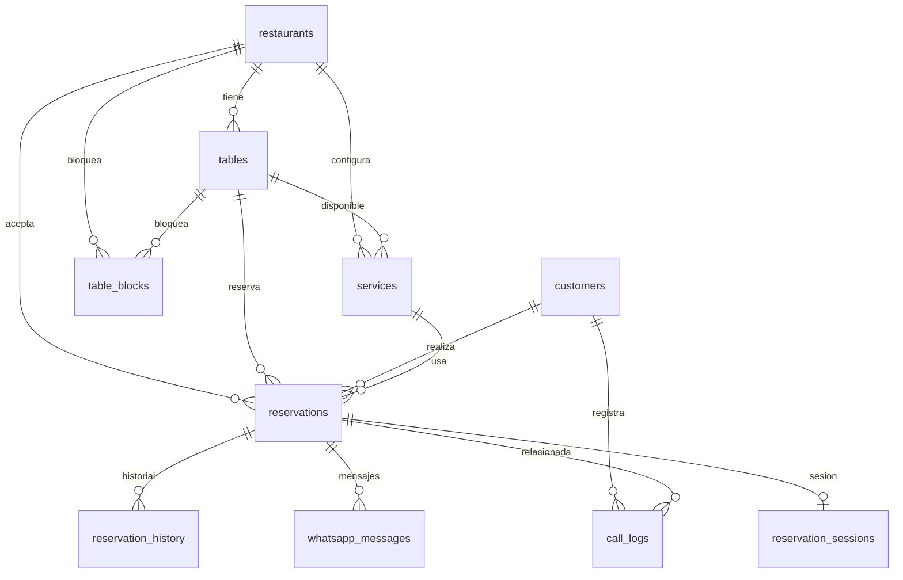

# Database Schema

> Sistema de Reservas - Documentación de Base de Datos
> Última actualización: 2026-03-30

---

## 📊 Diagrama de Entidades



---

## 📋 Descripción de Tablas

### restaurants
Restaurantes del sistema.

| Columna | Tipo | Nullable | Default | Descripción |
|---------|------|----------|---------|-------------|
| id | uuid | ❌ | auto | Identificador único |
| name | text | ❌ | - | Nombre del restaurante |
| phone | text | ✅ | - | Teléfono de contacto |
| address | text | ✅ | - | Dirección física |
| timezone | text | ✅ | Europe/Madrid | Zona horaria |
| isActive | boolean | ✅ | true | Estado activo |
| createdAt | timestamp | ✅ | now() | Fecha de creación |
| updatedAt | timestamp | ✅ | now() | Fecha de actualización |

---

### tables
Mesas disponibles en los restaurantes.

| Columna | Tipo | Nullable | Default | Descripción |
|---------|------|----------|---------|-------------|
| id | uuid | ❌ | auto | Identificador único |
| restaurantId | uuid | ❌ | - | FK → restaurants |
| tableNumber | text | ❌ | - | Número de mesa |
| tableCode | text | ❌ | - | Código (I-1, I-2, T-1, etc.) |
| capacity | integer | ❌ | - | Capacidad de personas |
| location | text | ✅ | - | Ubicación (interior, terraza, patio) |
| isAccessible | boolean | ✅ | false | Accesible para silla de ruedas |
| shape | text | ❌ | rectangular | Forma visual |
| positionX | integer | ✅ | 0 | Posición X en canvas |
| positionY | integer | ✅ | 0 | Posición Y en canvas |
| rotation | integer | ✅ | 0 | Rotación en grados |
| width | integer | ✅ | 100 | Ancho en px |
| height | integer | ✅ | 80 | Alto en px |
| diameter | integer | ✅ | 80 | Diámetro en px |
| stoolCount | integer | ✅ | 0 | Número de sillas |
| stoolPositions | jsonb | ✅ | - | Posiciones de sillas |
| createdAt | timestamp | ✅ | now() | Fecha de creación |
| **deletedAt** | timestamp | ✅ | - | **Soft delete** |
| **deletedBy** | text | ✅ | - | **Usuario que eliminó** |

**Índices:**
- `tables_table_code_idx` → (tableCode, restaurantId) único
- `tables_deleted_at_idx` → (deletedAt)

---

### services
Configuración de servicios (comida/cena) por restaurante.

| Columna | Tipo | Nullable | Default | Descripción |
|---------|------|----------|---------|-------------|
| id | uuid | ❌ | auto | Identificador único |
| restaurantId | uuid | ❌ | - | FK → restaurants |
| name | text | ❌ | - | Nombre del servicio |
| description | text | ✅ | - | Descripción |
| isActive | boolean | ✅ | true | Estado activo |
| serviceType | text | ❌ | - | 'comida' o 'cena' |
| season | text | ❌ | todos | Temporada |
| dayType | text | ❌ | all | weekday, weekend, all |
| startTime | text | ❌ | - | Hora inicio (HH:MM) |
| endTime | text | ❌ | - | Hora fin (HH:MM) |
| defaultDurationMinutes | integer | ❌ | 90 | Duración por reserva |
| bufferMinutes | integer | ❌ | 15 | Tiempo entre turnos |
| slotGenerationMode | text | ❌ | auto | auto o manual |
| dateRange | jsonb | ✅ | - | Rango de fechas |
| manualSlots | jsonb | ✅ | - | Turnos manuales |
| availableTableIds | jsonb | ✅ | - | Mesas disponibles |
| createdAt | timestamp | ✅ | now() | Fecha de creación |
| updatedAt | timestamp | ✅ | now() | Fecha de actualización |
| **deletedAt** | timestamp | ✅ | - | **Soft delete** |
| **deletedBy** | text | ✅ | - | **Usuario que eliminó** |

**Índices:**
- `services_restaurant_idx` → (restaurantId)
- `services_active_idx` → (isActive)
- `services_service_type_idx` → (serviceType)
- `services_deleted_at_idx` → (deletedAt)
- `uniqueService` → (restaurantId, dayType, startTime) único

---

### customers
Clientes del sistema.

| Columna | Tipo | Nullable | Default | Descripción |
|---------|------|----------|---------|-------------|
| id | uuid | ❌ | auto | Identificador único |
| phoneNumber | text | ❌ | - | Teléfono único |
| name | text | ✅ | - | Nombre |
| noShowCount | integer | ✅ | 0 | Contador de no-shows |
| tags | text[] | ✅ | - | Etiquetas |
| gdprConsentedAt | timestamp | ✅ | - | Consentimiento GDPR |
| createdAt | timestamp | ✅ | now() | Fecha de creación |
| updatedAt | timestamp | ✅ | now() | Fecha de actualización |

---

### reservations
Reservas del sistema.

| Columna | Tipo | Nullable | Default | Descripción |
|---------|------|----------|---------|-------------|
| id | uuid | ❌ | auto | Identificador único |
| reservationCode | text | ❌ | - | Código único (RES-XXXX) |
| customerId | uuid | ✅ | - | FK → customers |
| customerName | text | ❌ | - | Nombre (denormalizado) |
| customerPhone | text | ❌ | - | Teléfono (denormalizado) |
| restaurantId | uuid | ❌ | - | FK → restaurants |
| reservationDate | text | ❌ | - | Fecha (YYYY-MM-DD) |
| reservationTime | text | ❌ | - | Hora (HH:MM) |
| partySize | integer | ❌ | - | Número de personas |
| tableIds | uuid[] | ✅ | - | IDs de mesas asignadas |
| status | text | ❌ | PENDIENTE | Estado de la reserva |
| source | text | ❌ | IVR | Origen de la reserva |
| serviceId | uuid | ✅ | - | FK → services |
| estimatedDurationMinutes | integer | ✅ | 90 | Duración estimada |
| actualEndTime | text | ✅ | - | Hora real de fin |
| sessionId | text | ✅ | - | ID de sesión IVR |
| sessionExpiresAt | timestamp | ✅ | - | Expiración de sesión |
| specialRequests | text | ✅ | - | Solicitudes especiales |
| isComplexCase | boolean | ✅ | false | Caso complejo |
| createdAt | timestamp | ✅ | now() | Fecha de creación |
| confirmedAt | timestamp | ✅ | - | Fecha de confirmación |
| cancelledAt | timestamp | ✅ | - | Fecha de cancelación |
| updatedAt | timestamp | ✅ | now() | Fecha de actualización |
| **deletedAt** | timestamp | ✅ | - | **Soft delete** |
| **deletedBy** | text | ✅ | - | **Usuario que eliminó** |

**Estados posibles:**
- `PENDIENTE` - Reserva creada, pendiente de confirmación
- `CONFIRMADO` - Reserva confirmada
- `CANCELADO` - Reserva cancelada
- `NO_SHOW` - Cliente no se presentó

**Índices:**
- `reservations_date_restaurant_idx` → (reservationDate, restaurantId)
- `reservations_date_service_idx` → (reservationDate, serviceId)
- `reservations_status_idx` → (status)
- `reservations_deleted_at_idx` → (deletedAt)

---

### reservation_history
Historial de cambios de estado de reservas.

| Columna | Tipo | Nullable | Default | Descripción |
|---------|------|----------|---------|-------------|
| id | uuid | ❌ | auto | Identificador único |
| reservationId | uuid | ❌ | - | FK → reservations |
| oldStatus | text | ✅ | - | Estado anterior |
| newStatus | text | ❌ | - | Nuevo estado |
| changedBy | text | ❌ | - | Usuario/sistema |
| metadata | jsonb | ✅ | - | Datos adicionales |
| createdAt | timestamp | ✅ | now() | Fecha del cambio |

---

### table_blocks
Bloqueos de mesas (mantenimiento, eventos, etc.).

| Columna | Tipo | Nullable | Default | Descripción |
|---------|------|----------|---------|-------------|
| id | uuid | ❌ | auto | Identificador único |
| tableId | uuid | ❌ | - | FK → tables |
| restaurantId | uuid | ❌ | - | FK → restaurants |
| blockDate | text | ❌ | - | Fecha (YYYY-MM-DD) |
| startTime | text | ❌ | - | Hora inicio (HH:MM) |
| endTime | text | ❌ | - | Hora fin (HH:MM) |
| reason | text | ❌ | - | Razón del bloqueo |
| notes | text | ✅ | - | Notas adicionales |
| createdBy | text | ❌ | - | Usuario que creó |
| createdAt | timestamp | ✅ | now() | Fecha de creación |

---

### call_logs
Registro de llamadas del bot de voz.

| Columna | Tipo | Nullable | Default | Descripción |
|---------|------|----------|---------|-------------|
| id | uuid | ❌ | auto | Identificador único |
| reservationId | uuid | ✅ | - | FK → reservations |
| restaurantId | uuid | ❌ | - | FK → restaurants |
| callerPhone | text | ❌ | - | Teléfono del llamante |
| callStartedAt | timestamp | ❌ | now() | Inicio de llamada |
| callDurationSecs | integer | ✅ | - | Duración en segundos |
| callEndReason | text | ✅ | - | Razón de fin |
| callCost | text | ✅ | - | Coste estimado |
| callSummary | text | ✅ | - | Resumen con IA |
| actionsTaken | jsonb | ❌ | [] | Acciones realizadas |
| createdAt | timestamp | ✅ | now() | Fecha de creación |

---

### whatsapp_messages
Mensajes de WhatsApp asociados a reservas.

| Columna | Tipo | Nullable | Default | Descripción |
|---------|------|----------|---------|-------------|
| id | uuid | ❌ | auto | Identificador único |
| reservationId | uuid | ❌ | - | FK → reservations |
| messageId | text | ❌ | - | ID de WhatsApp |
| direction | text | ❌ | - | inbound/outbound |
| status | text | ✅ | sent | Estado del mensaje |
| sentAt | timestamp | ✅ | now() | Fecha de envío |
| readAt | timestamp | ✅ | - | Fecha de lectura |
| createdAt | timestamp | ✅ | now() | Fecha de creación |

---

### reservation_sessions
Sesiones activas de IVR/Voice.

| Columna | Tipo | Nullable | Default | Descripción |
|---------|------|----------|---------|-------------|
| id | uuid | ❌ | auto | Identificador único |
| sessionId | text | ❌ | - | ID de sesión único |
| phoneNumber | text | ❌ | - | Teléfono del cliente |
| restaurantId | uuid | ✅ | - | FK → restaurants |
| conversationState | jsonb | ❌ | - | Estado de conversación |
| collectedData | jsonb | ❌ | - | Datos recolectados |
| expiresAt | timestamp | ❌ | - | Expiración de sesión |
| createdAt | timestamp | ✅ | now() | Fecha de creación |

---

## 🔍 Queries Comunes

### Obtener reservas activas (excluyendo soft delete)

```typescript
const activeReservations = await db.query.reservations.findMany({
  where: isNull(reservations.deletedAt),
  with: {
    customer: true,
    restaurant: true,
  },
})
```

### Obtener mesas disponibles de un restaurante

```typescript
const availableTables = await db.query.tables.findMany({
  where: and(
    eq(tables.restaurantId, restaurantId),
    isNull(tables.deletedAt)
  ),
})
```

### Obtener servicios activos por restaurante

```typescript
const activeServices = await db.query.services.findMany({
  where: and(
    eq(services.restaurantId, restaurantId),
    eq(services.isActive, true),
    isNull(services.deletedAt)
  ),
})
```

### Buscar reserva por código

```typescript
const reservation = await db.query.reservations.findFirst({
  where: and(
    eq(reservations.reservationCode, `RES-${code}`),
    isNull(reservations.deletedAt)
  ),
  with: {
    customer: true,
    tables: true,
    service: true,
  },
})
```

### Historial de cambios de una reserva

```typescript
const history = await db.query.reservationHistory.findMany({
  where: eq(reservationHistory.reservationId, reservationId),
  orderBy: [desc(reservationHistory.createdAt)],
})
```

---

## 📌 Notas Importantes

### Soft Delete
Las tablas principales (`reservations`, `tables`, `services`) usan **soft delete** en lugar de eliminar físicamente los registros:
- `deletedAt`: timestamp de eliminación
- `deletedBy`: email/username del usuario que eliminó

Para obtener solo registros activos, siempre incluir:
```typescript
where: isNull(tabla.deletedAt)
```

### Zonas Horarias
Las fechas se almacenan como texto (YYYY-MM-DD) para manejar correctamente zonas horarias.
Las horas se almacenan como texto (HH:MM) en formato 24h.

### Códigos de Reserva
Los códigos se generan automáticamente con formato `RES-XXXXX` (ej: `RES-A1B2C`).
Son únicos y case-insensitive en las búsquedas.

---

## 🚀 Migraciones

Para aplicar migraciones pendientes:
```bash
npm run db:push
```

Para abrir Drizzle Studio:
```bash
npm run db:studio
```
